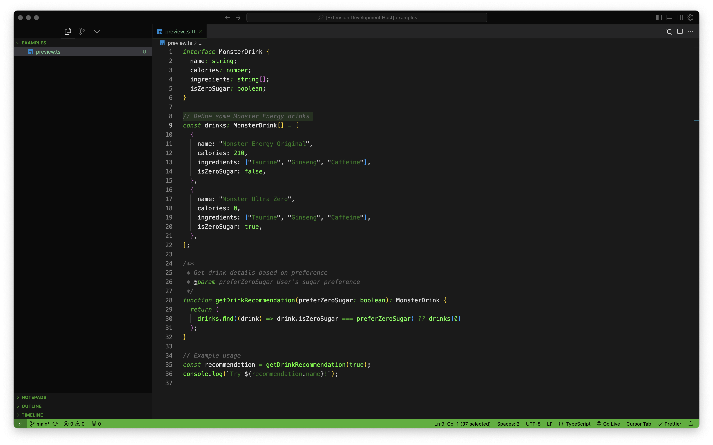
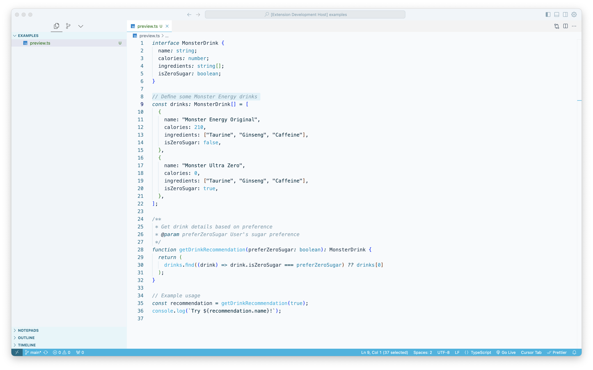

# Monster Energy Theme for VS Code

A Visual Studio Code theme inspired by Monster Energy drinks, featuring two distinct themes:

## Preview

### Monster Energy Original

### Monster Energy Ultra Zero

## Monster Energy Ultra Zero Theme

Clean, crisp, and refreshing - perfect for daylight coding with:

- Sophisticated ice blue accents
- Multi-layered backgrounds for depth
- High contrast for readability
- Carefully selected syntax highlighting
- Perfect for long coding sessions

## Monster Energy Theme

Classic Monster Energy-inspired dark theme featuring:

- Iconic Monster green highlights
- Dark background for reduced eye strain
- Silver accents for contrast
- Perfect for late-night coding sessions

## What's New in 0.0.2

- Enhanced Ultra theme with improved color hierarchy
- Added more depth to the light theme UI
- Improved syntax highlighting contrast
- Better visual separation between UI elements
- Refined color palette for better readability

## Installation

1. Open VS Code
2. Go to Extensions (Ctrl+Shift+X)
3. Search for "Monster Energy Theme"
4. Click Install
5. Press Ctrl+K Ctrl+T and select either:
   - "Monster Energy - Green"
   - "Monster Energy - Ultra"

## Contributing

Found a bug or have a suggestion? Open an issue or submit a PR on [GitHub](https://github.com/emilbergs/monster-theme).

## License

[MIT License](LICENSE)
